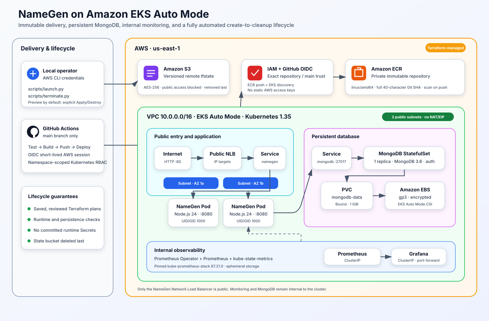
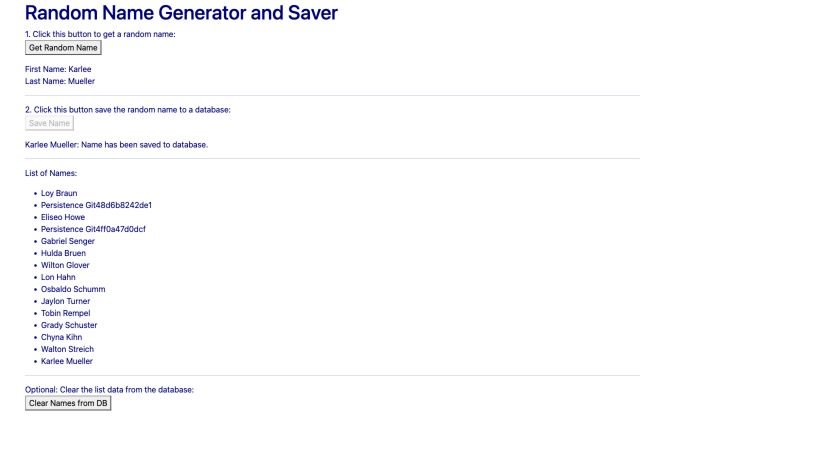
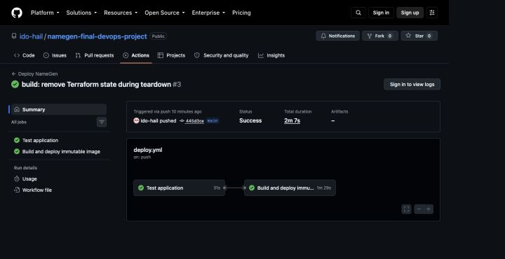

# NameGen · Final DevOps Project

[](https://github.com/ido-hail/namegen-final-devops-project/actions/workflows/deploy.yml)

NameGen is a Node.js application that generates and stores names in MongoDB. This repository turns the original application into a complete AWS deployment: Terraform provisions Amazon EKS Auto Mode and its supporting infrastructure, Kubernetes runs the application and persistent database, GitHub Actions delivers immutable images, and Prometheus with Grafana provides internal monitoring.

The lifecycle scripts are the supported interface. A default run is a non-mutating preview; an explicit `--apply` performs the reviewed deployment or teardown workflow.

## Architecture



The deployment contains:

- an EKS Auto Mode cluster running Kubernetes `1.35` across two public subnets;
- two non-root NameGen Pods behind an internet-facing Network Load Balancer;
- one authenticated MongoDB `3.6` StatefulSet backed by an encrypted `1 GiB` `gp3` EBS volume;
- a private ECR repository with immutable, scanned, full-Git-SHA images;
- GitHub Actions authentication through OIDC and namespace-scoped Kubernetes RBAC;
- an internal, ephemeral `kube-prometheus-stack` deployment with a four-panel Grafana dashboard;
- an encrypted and versioned S3 Terraform state bucket created by launch and deleted last by teardown.

There is no NAT Gateway or Elastic IP. Only the NameGen NLB is public; MongoDB, Prometheus, and Grafana remain internal.

## Verified deployment

The final environment was validated end to end. The concise, sanitized runtime record is available in [docs/evidence/runtime-validation.md](docs/evidence/runtime-validation.md).

**Application and MongoDB:** the public UI generated a name, stored it, and read the updated list from MongoDB.



**GitHub Actions delivery:** both the application test job and the immutable build-and-deploy job succeeded.



The evidence deliberately excludes the AWS Account ID, generated endpoint, runtime Secrets, and resource IDs.

## Repository layout

```text
.
├── .github/workflows/       # Tested, immutable application delivery
├── data/                    # MongoDB data access layer
├── docs/                    # Architecture and deployment evidence
├── k8s/                     # NameGen, MongoDB, storage, Service, and CI RBAC
├── monitoring/              # Helm values and Grafana dashboard
├── scripts/
│   ├── launch.py            # Preview or create and validate the full environment
│   └── terminate.py         # Preview or remove and audit the full environment
├── terraform/
│   ├── bootstrap/           # S3 state-bucket bootstrap
│   └── modules/             # Network, ECR, EKS, and GitHub OIDC
├── tests/                   # Application and automation tests
└── Dockerfile               # Node.js 24, linux/amd64, non-root runtime
```

## Prerequisites

Install and authenticate the following tools:

- Python 3.10 or newer;
- AWS CLI v2 with permission to create the documented resources;
- Terraform `>= 1.10, < 2.0`;
- Docker with Buildx;
- `kubectl` compatible with Kubernetes `1.35`;
- Helm 3;
- Git;
- Node.js 24 and npm for local application tests.

Confirm the AWS identity and Docker daemon before deployment:

```sh
aws sts get-caller-identity
docker info
```

Clone the repository and review the example variables:

```sh
git clone https://github.com/ido-hail/namegen-final-devops-project.git
cd namegen-final-devops-project
cp terraform/terraform.tfvars.example terraform/terraform.tfvars
```

The checked-in defaults target this repository. A fork must replace the GitHub owner, immutable owner ID, repository name, repository ID, and branch in `terraform/terraform.tfvars` before applying.

## Deploy

### 1. Preview

```sh
python3 scripts/launch.py
```

Preview validates prerequisites, Git state, Terraform, Kubernetes manifests, monitoring configuration, AWS identity, resource collisions, and a saved create-only Terraform plan. It does not create runtime infrastructure. On the first preview, it can stop after reporting that the state bucket does not yet exist; the Apply workflow creates it.

### 2. Create and validate the complete environment

```sh
python3 scripts/launch.py --apply
```

Type `APPLY` when prompted. For a pre-approved non-interactive run:

```sh
python3 scripts/launch.py --apply --yes
```

Apply requires a clean `main` branch synchronized with `origin/main`. It then:

1. creates the encrypted, versioned, private S3 state bucket;
2. builds and applies a saved, create-only Terraform plan;
3. provisions the VPC, ECR, EKS Auto Mode, IAM, and GitHub OIDC resources;
4. builds a `linux/amd64` non-root image tagged with the full Git commit SHA and verifies its ECR digest;
5. generates runtime-only MongoDB and Grafana credentials and applies the Kubernetes workloads;
6. validates replica counts, the Bound PVC, encrypted `gp3` EBS, the public NLB, and the application API;
7. recreates only `mongodb-0` and verifies that its data and PersistentVolume survive;
8. deploys the pinned monitoring stack and verifies the dashboard and a live Prometheus series.

The final summary prints the public application URL and the validated runtime evidence. The full launch workflow is intended for a clean environment. Use GitHub Actions for later application-only releases.

## Access and inspect

The public URL is printed by `launch.py`. Useful runtime checks are:

```sh
kubectl --namespace namegen get deployment,statefulset,pods,pvc,service
kubectl --namespace namegen rollout status deployment/namegen
kubectl --namespace namegen rollout status statefulset/mongodb
```

Grafana is deliberately not public. Start a local tunnel:

```sh
kubectl --namespace monitoring port-forward \
  service/namegen-monitoring-grafana 3000:80
```

Then open <http://localhost:3000>. The generated administrator password can be read locally without storing it in Git:

```sh
kubectl --namespace monitoring get secret grafana-admin-credentials \
  --output=jsonpath='{.data.admin-password}' | base64 --decode
echo
```

The `NameGen Kubernetes Runtime` dashboard shows Ready Pods, Pod Restarts, CPU usage, and memory usage.

## CI/CD

`.github/workflows/deploy.yml` runs on relevant pushes to `main` and by manual dispatch:

1. test the application against MongoDB `3.6` and run the Python automation suite;
2. assume the deployment role through GitHub OIDC—no static AWS access keys;
3. reuse or build the immutable image for `GITHUB_SHA` and verify its digest and non-root identity;
4. update only the reviewed NameGen Deployment;
5. verify two Ready application replicas, the expected image, MongoDB readiness, and the public NLB endpoint.

After the first infrastructure deployment, configure these repository values:

| Type | Name | Source |
|---|---|---|
| Secret | `AWS_ACCOUNT_ID` | `terraform -chdir=terraform output -raw aws_account_id` |
| Secret | `AWS_ROLE_ARN` | `terraform -chdir=terraform output -raw github_actions_role_arn` |
| Variable | `AWS_REGION` | deployment region, normally `us-east-1` |
| Variable | `ECR_REPOSITORY` | `namegen` |
| Variable | `EKS_CLUSTER_NAME` | `namegen-eks` |

The two Secrets are identity metadata used to keep account details out of logs; they are not AWS credentials. The IAM role can push only to the project ECR repository and discover only the project EKS cluster. Kubernetes RBAC limits it to updating the `namegen` Deployment and reading the application Service and MongoDB StatefulSet.

## Remove everything

Always preview the destroy plan first:

```sh
python3 scripts/terminate.py
```

Then remove the environment:

```sh
python3 scripts/terminate.py --apply
```

Type `DESTROY` when prompted, or use `--yes` only after the preview has been reviewed:

```sh
python3 scripts/terminate.py --apply --yes
```

Teardown discovers the NLB and EBS volume before deletion, removes monitoring and Kubernetes resources, waits for their external AWS resources to disappear, applies only the saved delete-only Terraform plan, and audits EKS, ECR, VPC, IAM, EC2, NLB, EBS, Terraform state, and OIDC ownership. Only after those checks pass does it delete every S3 object version and delete the state bucket itself. A successful run leaves no NameGen AWS resources.

The operation permanently deletes MongoDB data. Do not run it before capturing the required evidence.

## Local validation

Run the fast application and automation tests with a local MongoDB connection:

```sh
export MONGODB_URL='mongodb://127.0.0.1:27017/namegen'
npm ci
npm test
PYTHONPYCACHEPREFIX=/private/tmp/namegen-pycache \
  python3 -m unittest discover -s tests -p 'test_*.py'
```

Render and validate the declarative configuration:

```sh
terraform -chdir=terraform fmt -check -recursive
terraform -chdir=terraform validate
terraform -chdir=terraform/bootstrap fmt -check -recursive
terraform -chdir=terraform/bootstrap validate
kubectl kustomize k8s >/dev/null
kubectl kustomize monitoring >/dev/null
helm template namegen-monitoring \
  prometheus-community/kube-prometheus-stack \
  --version 87.21.0 \
  --namespace monitoring \
  --values monitoring/values.yaml >/dev/null
```

## Security and cost notes

- Kubernetes and Grafana Secrets are generated at runtime and never committed.
- The application image is immutable, non-root, capability-dropped, and restricted to `linux/amd64`.
- ECR scanning is enabled, EBS is encrypted, and the S3 state bucket is encrypted, versioned, and public-access-blocked.
- Monitoring uses internal `ClusterIP` Services and ephemeral storage.
- EKS, its compute, EBS, and the internet-facing NLB are billable. Run the teardown workflow when the review is complete.

## License

This project retains the original [MIT License](LICENSE).
